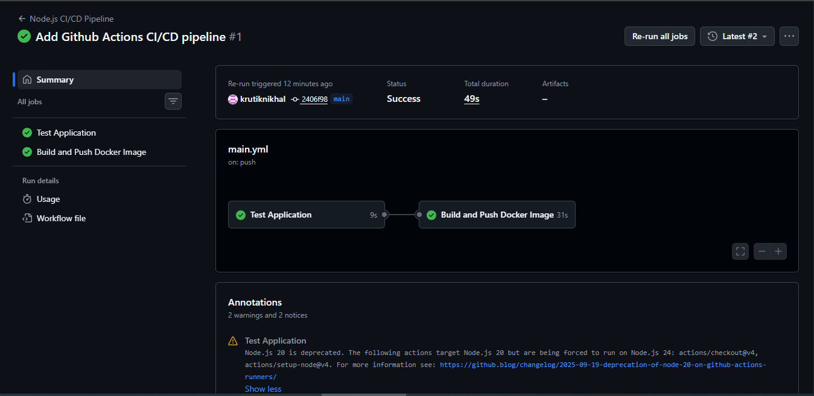
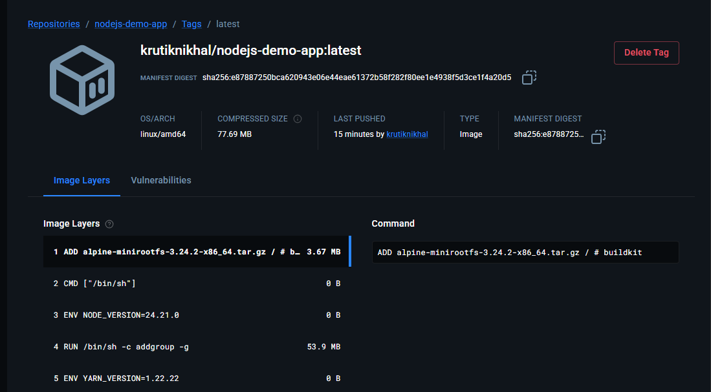
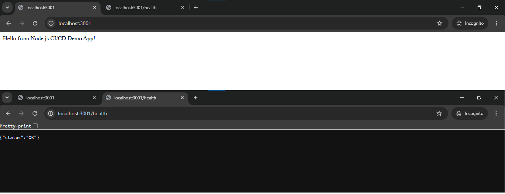

# Node.js CI/CD Pipeline with GitHub Actions

## Project Overview

This project demonstrates a CI/CD pipeline for a Node.js web application using GitHub Actions and Docker.

The pipeline is triggered automatically whenever code is pushed to the `main` branch. It runs automated tests, builds a Docker image after the tests pass, and pushes the image to Docker Hub.

## Tools and Technologies

- Node.js
- Express.js
- Jest
- Supertest
- Docker
- Git
- GitHub
- GitHub Actions
- Docker Hub

## Project Structure

```text
nodejs-demo-app/
├── .github/
│   └── workflows/
│       └── main.yml
├── screenshots/
│   ├── githubactions.png
│   ├── dockerhubimage.png
│   └── apprunning.png
├── .dockerignore
├── .gitignore
├── Dockerfile
├── app.js
├── app.test.js
├── server.js
├── package.json
├── package-lock.json
└── README.md
```

## Application Endpoints

### Home Endpoint

```text
GET /
```

Response:

```text
Hello from Node.js CI/CD Demo App!
```

### Health Check Endpoint

```text
GET /health
```

Response:

```json
{
  "status": "OK"
}
```

## Running the Application Locally

### 1. Install Dependencies

```bash
npm ci
```

### 2. Run Automated Tests

```bash
npm test
```

### 3. Start the Application

```bash
npm start
```

The application runs on:

```text
http://localhost:3000
```

## Running the Application with Docker

### Build the Docker Image

```bash
docker build -t nodejs-demo-app .
```

### Run the Container

```bash
docker run -d -p 3000:3000 --name nodejs-demo-container nodejs-demo-app
```

The application can then be accessed at:

```text
http://localhost:3000
```

## CI/CD Pipeline

The GitHub Actions workflow is configured in:

```text
.github/workflows/main.yml
```

The workflow is automatically triggered whenever a commit is pushed to the `main` branch.

The pipeline follows this process:

```text
Push to main
     |
     v
GitHub Actions
     |
     v
Install Dependencies
     |
     v
Run Automated Tests
     |
     v
Build Docker Image
     |
     v
Login to Docker Hub
     |
     v
Push Docker Image
```

### Test Job

The `test` job performs the following steps:

1. Checks out the source code.
2. Sets up Node.js.
3. Installs project dependencies using `npm ci`.
4. Runs automated tests using Jest.

If the tests fail, the Docker build and push job will not run.

### Build and Push Job

The `build-and-push` job runs only after the `test` job completes successfully.

It performs the following steps:

1. Checks out the source code.
2. Authenticates with Docker Hub using GitHub Secrets.
3. Builds the Docker image.
4. Pushes the image to Docker Hub with the `latest` tag.

## Docker Hub Image

The Docker image generated by the CI/CD pipeline is:

```text
krutiknikhal/nodejs-demo-app:latest
```

To pull the image from Docker Hub:

```bash
docker pull krutiknikhal/nodejs-demo-app:latest
```

To run the pulled image:

```bash
docker run -d -p 3001:3000 --name cicd-demo-container krutiknikhal/nodejs-demo-app:latest
```

The application can then be accessed at:

```text
http://localhost:3001
```

## GitHub Secrets

Docker Hub credentials are securely stored using GitHub Actions repository secrets.

The following secrets are configured:

```text
DOCKERHUB_USERNAME
DOCKERHUB_TOKEN
```

The actual credential values are not stored in the repository or workflow file.

## Screenshots

### Successful GitHub Actions Pipeline



### Docker Hub Image



### Running Application



## What I Learned

Through this project, I gained hands-on experience with:

- Creating a CI/CD pipeline using GitHub Actions.
- Configuring a workflow to trigger on pushes to the `main` branch.
- Understanding GitHub Actions workflows, jobs, steps, and runners.
- Integrating automated tests into a CI pipeline.
- Building a Node.js application into a Docker image.
- Using GitHub Secrets for Docker Hub authentication.
- Automatically pushing Docker images to Docker Hub.
- Pulling and running Docker images from Docker Hub.
- Troubleshooting GitHub Actions and Docker Hub authentication issues.

## Conclusion

This project demonstrates an automated CI/CD workflow for a containerized Node.js application.

Every push to the `main` branch triggers the GitHub Actions workflow. The application dependencies are installed and automated tests are executed. If the tests pass successfully, a Docker image is built and pushed to Docker Hub automatically.